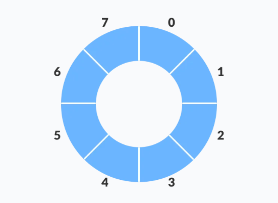
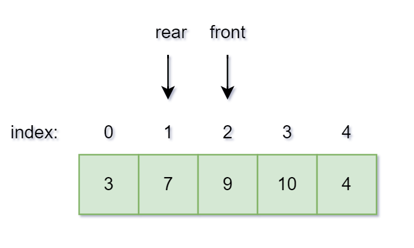
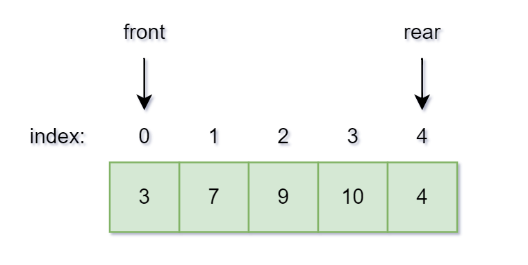

# Ring-Buffer

Refrence:https://www.programiz.com/dsa/circular-queue

## What is the Ring Buffer (Circular Buffer) ?
A circular queue is the extended version of a `regular queue` where the last element is connected to the first element.

    

## Code hoạt động của Ring Buffer
**Phần khai báo.**
~~~cpp
#include <stdio.h>

#define SIZE 5

int items[SIZE]; // khai báo mảng 5 phần tử để chứa dữ liệu 
int front = -1, rear = -1;
~~~

**CODE: Check if the queue is full.**
~~~cpp
int isFull() {
  if ((front == rear + 1) || (front == 0 && rear == SIZE - 1)) return 1;
  return 0;
  /*
     - Ta cần lưu ý: nếu mà vị trí  front = 0; rear = 4 thì điều kiện front = 0 khác rear + 1 = 5
    => return 0 nghĩa là Ring Buffer chưa full => Sai.
     - Cho nên ta cần phải có điều kiện: (front == 0 && rear = SIZE - ) => Tránh vào trường
    hợp như trên.
  */
}
~~~

    

    

~~~cpp
// Check if the queue is empty
int isEmpty() {
  if (front == -1) return 1;
  return 0;
}

// Adding an element
void enQueue(int element) {
  if (isFull())
    printf("\n Queue is full!! \n");
  else {
    if (front == -1) front = 0;
    rear = (rear + 1) % SIZE;
    items[rear] = element;
    printf("\n Inserted -> %d", element);
  }
}

// Removing an element
int deQueue() {
  int element;
  if (isEmpty()) {
    printf("\n Queue is empty !! \n");
    return (-1);
  } else {
    element = items[front];
    if (front == rear) {
      front = -1;
      rear = -1;
    } 
    // Q has only one element, so we reset the 
    // queue after dequeing it. ?
    else {
      front = (front + 1) % SIZE;
    }
    printf("\n Deleted element -> %d \n", element);
    return (element);
  }
}

// Display the queue
void display() {
  int i;
  if (isEmpty())
    printf(" \n Empty Queue\n");
  else {
    printf("\n Front -> %d ", front);
    printf("\n Items -> ");
    for (i = front; i != rear; i = (i + 1) % SIZE) {
      printf("%d ", items[i]);
    }
    printf("%d ", items[i]);
    printf("\n Rear -> %d \n", rear);
  }
}

int main() {
  // Fails because front = -1
  deQueue();

  enQueue(1);
  enQueue(2);
  enQueue(3);
  enQueue(4);
  enQueue(5);

  // Fails to enqueue because front == 0 && rear == SIZE - 1
  enQueue(6);

  display();
  deQueue();

  display();

  enQueue(7);
  display();

  // Fails to enqueue because front == rear + 1
  enQueue(8);

  return 0;
}
~~~
